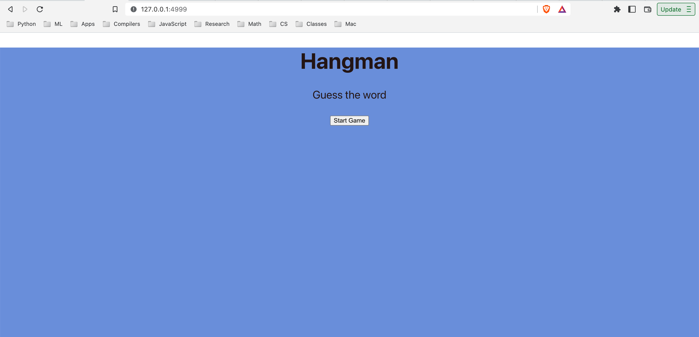
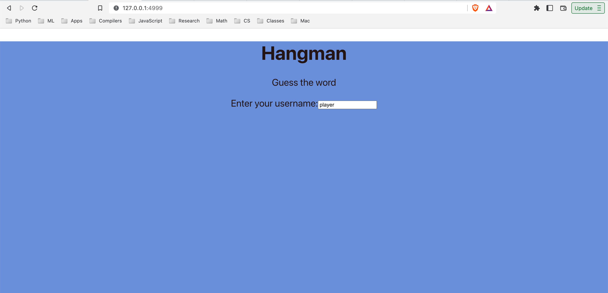

# Project 1: Hangman

Here we have created a Hangman game using python that deploys to the browser.

The game is a simple word guessing game where the user has to guess the word before the
hangman is drawn. The user has 6 chances to guess the word correctly. If the user guesses
the word correctly, the user wins. If the user fails to guess the word correctly, the user loses.

## How to play

1. Download the code from the repository.
2. In your terminal, install the following packages:
    * Using conda:
        * `conda install python` (if you don't have python installed)
        * `conda install flask flask-cors`
        * `conda install -c conda-forge ariadne`
    * Using pip:
        * `pip install flask flask-cors`
        * `pip install ariadne`
3. Inside the project1/hangman directory, run `python main.py`
4. Open your browser and go to `http://127.0.0.1:4999/`
5. The game will then be in the start state. Click on the "Start Game" button to start the game. 
6. The game will then prompt the user for a username. Enter a username and hit "Enter". 
7. This will then take the user to the menu page which presents the following options:
    * Start Game
    * Quit Game
    * New Player
    * (There was a display user stats option, but instead we just display the current user's stats on the menu page) 

8. Click on the "Play Game" button to start the game.
9. The game will then prompt the user to select a difficulty level. The difficulty levels are from 1 to 10 and represent the length of the word to be guessed. 
10. The user will then be taken to the main game screen where the user will enter guesses on the provided keyboard.  
11. The user will have 6 chances to guess the word correctly. If the user guesses the word correctly, the user wins. If the user fails to guess the word correctly, the user loses.

12. After winning or losing, the stats for the player are updated and saved, and the user is redirected to the menu page.
13. If the user chooses "New Player" on the menu page, the user will be redirected to a prompt for a new username. The user will then be redirected to the menu page.
14. If the user chooses "Quit Game" on the menu page, the user will be redirected to a page with a "Quit Game" button. Clicking on the "Quit Game" button will terminate the server and end the game. 
15. Then, just exit out of the web page.

## How to run tests

1. Download the code from the repository.
2. In your terminal, install the following packages:
    * Using conda:
        * `conda install python` (if you don't have python installed)
        * `conda install -c conda-forge pytest`

    * Using pip:
        * `pip install pytest`

3. Inside the project1/hangman directory, run `pytest`
4. The tests will run and verify the business logic of the Model in the MVC design pattern as well as the database logic.

## How to rebuild the frontend
1. Install NodeJs and npm using the instructions on the [NodeJs website](https://nodejs.org/en/download/).
2. In your terminal, navigate to the project1/hangman/mvc/view directory.
3. Run `npm install` to install the dependencies.
4. Run `npm run genql` to generate the GraphQL Schema Definitions.
5. Run `npm run build` to build the frontend.

## Design Decisions

The game uses a Model-View-Controller design pattern in a full-stack application with the following technologies:
* Flask 
* SQLite
* GraphQL
* React

The Model is the business logic of the game. 

The View is the frontend of the game. 

The Controller is the backend of the game. 

The View and Controller communicate with each other using GraphQL while the controller communicates with the model using native python.

Our controller uses a Finite State Machine to handle the different states of the game. The states are as follows:
* Start
* Input Player Username
* Load Player
* Create Player
* Menu
* Input Difficulty
* Guess
* Win
* Lose
* Quit

The following is a diagram of the Finite State Machine: 

Our game uses a word bank contained in the `words.json` file contained in the project1/hangman/utils directory. The words range from a length of 1 to 10 characters.

The game uses a SQLite database to store the player's stats. The database is handled in the model using helper functions contained in `database.py` found in the project1/hangman/utils directory.

The game uses a GraphQL schema to communicate between the frontend and backend. The schema is defined in the `schema.graphql` file found in the project1/hangman/ directory. This file is used to control the graphQL schema for the controller. The schema for the front end is generated from `schema.graphql` using the `npm run genql` command.

The front-end was created using Typescript and React. The front-end is contained in the `mvc/view` directory. The front-end uses the `npm run build` command to build the front-end. The built front-end is contained in the `mvc/view/build` directory.

Since our project was for an Advanced Programming with Python class, the front-end did not have an excess amount of styling applied to it. The front-end was created to be functional and show that the game worked properly.

A Keyboard in React is presented on the front end for inputting guesses. This accomplishes input validation for the guesses performed by the user since only the characters on the keyboard can be sent back to the server.